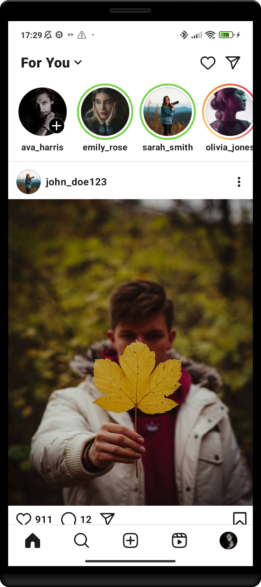
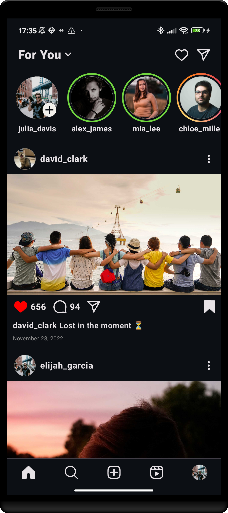
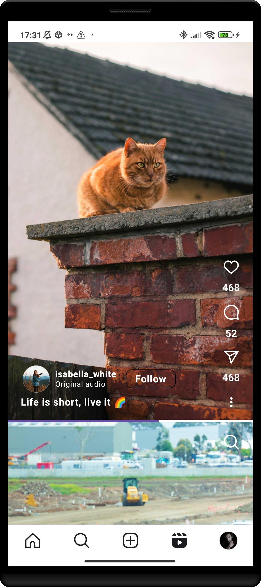
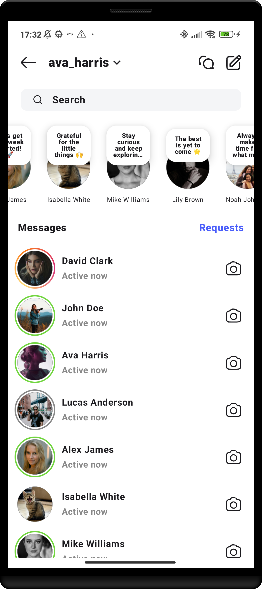
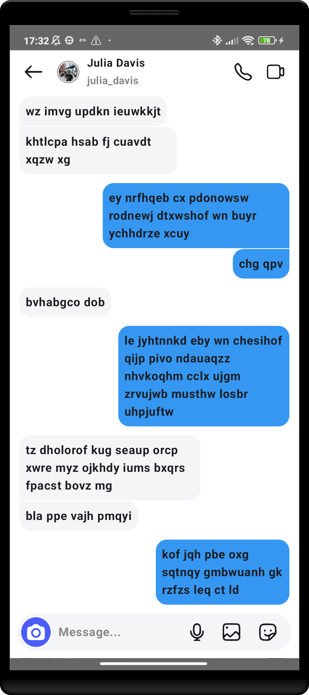
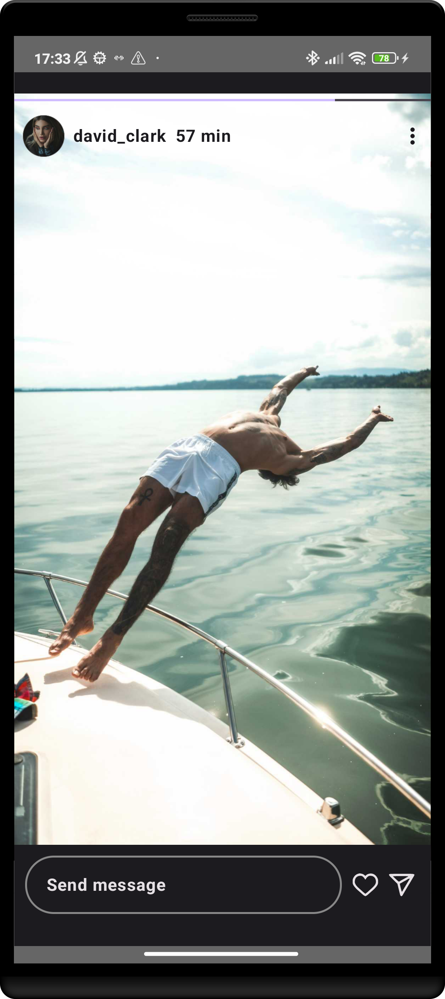
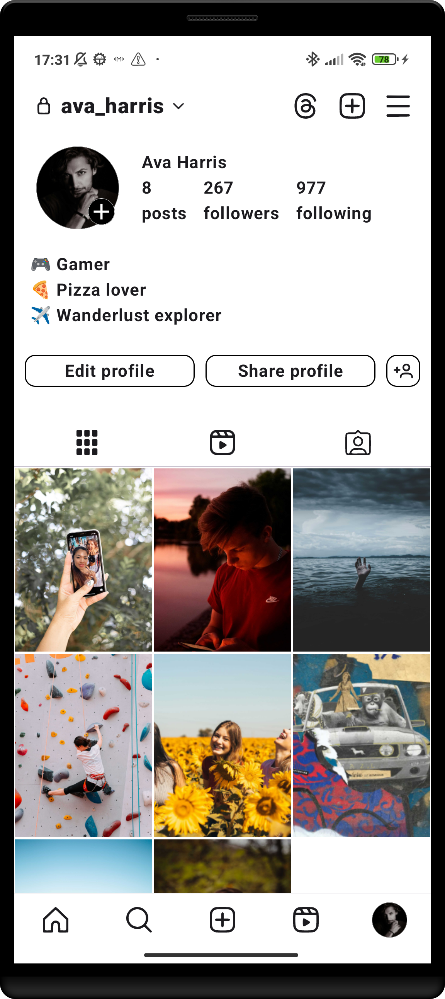

# Instagram Clone 📸

A UI clone of Instagram built using **Jetpack Compose**. This project replicates the look and feel of Instagram's main pages, including Home Feed, Stories, Explore, Reels (placeholder), My Profile, and Chats screen.

---

## Features 🚀
- Smooth scrolling in Home Feed Page
- Stories viewing dialog with swipe gestures
- Explore page with grid-style layout
- Reels page (no video, just a placeholder)
- My Profile page with sample posts, reels, and tagged posts
- Smooth transition to Chats screen and option to open individual chats
- Instagram-like icons and UI components
- Sample data for users, posts, reels, messages, stories, and notes

---

## Screenshots 📱
| Home Feed | Home Feed Dark | Explore Page |  Reels Page | 
| --------- | ------------ | ---------- | ---------- | 
|  |  |  |  |
| Chats Page | Chat | Story Viewer | My Profile |
|  |  |  |  |

---

## Demo 🎥

---

## Tech Stack 🛠️
- **Kotlin** - Language used
- **Jetpack Compose** - Modern UI toolkit
- **Material 3** - UI components and styling
- **Custom Composables** - Own UI components suited for this project
- **Navigation** - Jetpack Compose Navigation
- **Coroutines** - Asynchronous programming

---

## Future Improvements 🚧
- Implement video playback in Reels
- Add functionality to view Comments
- Improve animations and transitions
- Enhance smoothness 

---

## License 📄
This project is licensed under the **MIT License** - see the [LICENSE](LICENSE) file for details.

---

## Acknowledgements 🙏
- Inspired by the Instagram app design
- Icons were screenshot from the Instagram app and converted to SVG

---

## Contact 📫
For any inquiries or feedback, feel free to contact me:
- **LinkedIn:** [Marek Storek](https://www.linkedin.com/in/marekstorek)
- **Email:** marek.storek1@gmail.com
